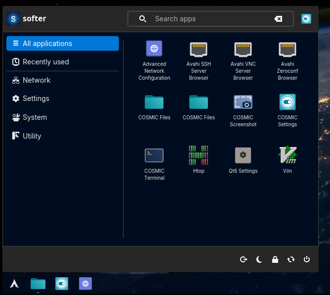

# WMDE Start Menu

WMDE Start Menu is a customizable application launcher for the COSMIC™ desktop environment. It provides a classic, Windows-style start menu for launching applications, accessing system tools, and managing power options.

It is part of the [WMDE desktop](https://wmde.fun) and is a fork of
[championpeak87/cosmic-ext-classic-menu](https://github.com/championpeak87/cosmic-ext-classic-menu),
originally created by Kamil Lihan.



## Features

- Classic-style application menu
- Search functionality with fuzzy matching and typo tolerance
- Categorized application list
- Recently used applications
- Power options (shutdown, restart, logout, etc.)
- System tools (settings, system monitor, disk management)

## Known issues

- Context menu is misaligned when the list is scrolled
- Popup is not in focus when opened, search field and arrow key navigation may not work properly unless the popup is in focus by clicking on it

## Installation (Arch Linux)

A `PKGBUILD` is provided. Build and install a package with `makepkg`:

```bash
makepkg -si
```

Or build and install manually from source:

```bash
just build-release
sudo just install
```

## Contributing

A [justfile](./justfile) is included with common recipes:

- `just build-debug` compiles with debug profile
- `just run` builds and runs the application
- `just check` runs clippy on the project to check for linter warnings
- `just check-json` can be used by IDEs that support LSP

## Credits

WMDE Start Menu is a fork of [cosmic-ext-classic-menu](https://github.com/championpeak87/cosmic-ext-classic-menu)
by **Kamil Lihan** ([championpeak87](https://github.com/championpeak87)). All original authorship
and copyright are retained; see [LICENSE](./LICENSE).

## License

Code is distributed under the [GPL-3.0-only license](./LICENSE).
